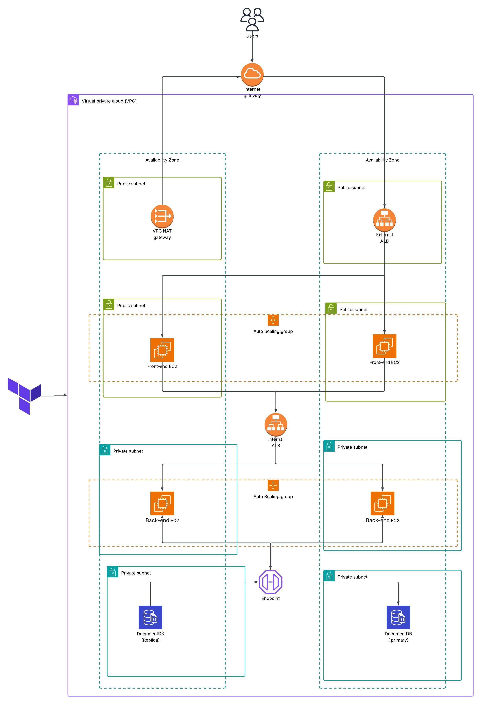

# 🚀 Scalable AWS Infrastructure with Terraform

This project provisions a fully scalable and modular AWS infrastructure using **Terraform**, following best practices for **high availability**, **security**, and **automation**. It includes VPC setup, public/private subnets, ALBs, Auto Scaling Groups for frontend and backend services, secure database provisioning, and modular security group configuration.

## Project Architecture



---

## Project Overview

This project implements a classic 3-tier web architecture using Terraform:

- Presentation Tier – Frontend servers in private subnets
- Application Tier – Backend logic in private subnets
- Data Tier – MongoDb DocumentDb database in isolated subnets
  It includes networking, security groups, NAT gateways, and all components needed for a robust infrastructure.

---

## 🧰 Technologies Used

- **Terraform v1.x**
- **AWS EC2**, **VPC**, **ALB**, **ASG**, **Security Groups**
- **MongoDB** (as backend database)
- **User Data Scripts** for automated provisioning
- Modular and reusable Terraform modules

---

## 🧱 Project Structure

```
.
├── Backend
│   ├── package.json
│   └── server.js
├── Frontend
│   ├── package.json
│   ├── public
│   └── src
│       └── App.js
└── Terraform
    ├── backend.tf
    ├── main.tf
    ├── modules
    │   ├── ALB
    │   │   ├── main.tf
    │   │   ├── output.tf
    │   │   └── variables.tf
    │   ├── ASG
    │   │   ├── main.tf
    │   │   ├── outputs.tf
    │   │   ├── UserData
    │   │   │   ├── backend.sh.tpl
    │   │   │   └── frontend.sh.tpl
    │   │   └── variables.tf
    │   ├── database
    │   │   ├── main.tf
    │   │   ├── output.tf
    │   │   └── variable.tf
    │   ├── security-groups
    │   │   ├── main.tf
    │   │   ├── output.tf
    │   │   └── variables.tf
    │   └── vpc
    │       ├── main.tf
    │       ├── output.tf
    │       └── variables.tf
    ├── mykey.pub
    ├── output.tf
    ├── provider.tf
    ├── terraform.tfvars
    └── variables.tf
```

---

## 📦 Features

- 🔐 Isolated Public and Private subnets
- 🌐 Public ALB for frontend traffic, internal ALB for backend communication
- ⚖️ Auto Scaling Groups for frontend and backend services
- 🛡️ Fine-grained Security Group rules
- 💾 MongoDB backend in private subnets
- 📄 Modular, reusable, and readable Terraform codebase

---

## 🛠️ Prerequisites

Before you begin, ensure you have:

- [Terraform](https://developer.hashicorp.com/terraform/downloads) installed
- AWS CLI configured (`aws configure`)
- A valid AWS account with required IAM permissions
- An existing SSH key pair or generate one (`.pem` file for access)

---

## 🚀 Deployment Instructions

1. **Clone this repository**:
   ```bash
   git clone https://github.com/your-username/aws-terraform-infra.git
   cd aws-terraform-infra
   ```

---

2. **Update Variables:**
   for example

   ```bash
   aws-region     = "us-east-1"
   vpc-cidr       = "10.0.0.0/16"
   public_key_path = "~/.ssh/id_rsa.pub"
   db_username     = "admin"
   db_password     = "your_secure_password"
   ```

---

3. **Initialize Terraform:**

   ```bash
   terraform init
   ```

---

4. **Preview the plan:**

   ```bash
   terraform plan -auto-approve -var db_username=<USER_NAME> -var db_password=<PASSWORD>
   ```

---

5. **Apply the configuration:**

   ```bash
   terraform apply -auto-approve -var db_username=<USER_NAME> -var db_password=<PASSWORD>
   ```

---

## 📡 Outputs

After successful deployment, you will get:

- ✅ VPC and subnet IDs

- ✅ Public ALB DNS (for accessing frontend)

- ✅ Private ALB DNS (for backend/internal communication)

- ✅ MongoDB instance endpoint (stored in SSM)

---

## 🧼 Clean Up

To destroy all resources and avoid ongoing AWS costs:

```bash
 terraform destroy -auto-approve -var db_username=<USER_NAME> -var db_password=<PASSWORD>
```

---

## 📎 Notes

- EC2 instances are not created directly; they are automatically managed by Auto Scaling Groups.

- Internal ALB is not publicly accessible, which helps isolate backend services.

- You may need to update your security groups or load balancer rules if integrating with other systems

---

## 🧑‍💻 Author

salma yasser <br>
DevOps Engineer <br>
📧 [sallmayasser512@gmail.com](mailto:sallmayasser512@gmail.com) <br>
🔗 [LinkedIn](https://www.linkedin.com/in/sallma-yasser)
